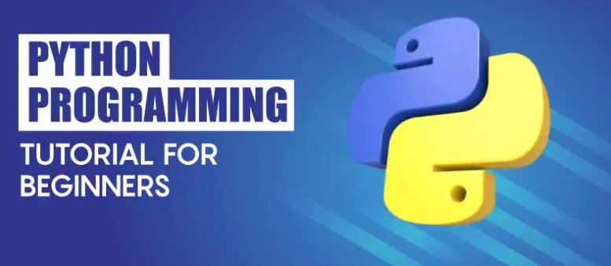

# Başlayanlar üçün Python Proqramlaşdırma nədir ?

### Bu bloq Python-a yeni başlayanlar üçün qısa bələdçidir, Python-un əhəmiyyəti, öyrənmə prosesi və dəyişənlər, məlumat növləri, tip çevrilmələri və operatorlar daxil olmaqla fundamental anlayışlar haqqında fikirlər təklif edir.😇

 

## 📋 Python nədir ?

## 📋 Başlayanlar üçün Python Təlimatı haqqında

## 📋 Niyə Python öyrənin ?

## 📋 Pythonu necə öyrənmək olar ?

## 📋 Python ilə işə başlamaq

 
 

# Python nədir ?

### ⭐ Python yüksək səviyyəli, object yönlü proqramlaşdırma dilidir.

### ⭐ Sadəliyi və oxunaqlılığı ilə tanınır və onu yeni başlayanlar üçün əla seçim edir.

### ⭐ Veb inkişafından tutmuş məlumatların təhlilinə və süni intellektə qədər müxtəlif proqramları dəstəkləyir.

### ⭐ Strukturunun bir hissəsi kimi girinti ilə asan başa düşülən sintaksisdən istifadə edir.

### ⭐ Python açıq mənbəli bir dildir, yəni istifadə etmək pulsuzdur və onun böyüməsinə töhfə verən geniş tərtibatçılar cəmiyyətinə malikdir.

  

## Niyə Python öyrənin 🤔?

- ### Populyarlıq: 

  > ### 
 Python bütün dünyada ən populyar proqramlaşdırma dillərindən biridir, bu o deməkdir ki, geniş tərtibatçılar icması və öyrənənlər üçün geniş resurslar mövcuddur.

  >
  >  

- ### Sadəlik:

  > ### 
 Python-un təmiz və oxunaqlı kodu onu yeni başlayanlar üçün ideal seçim edir.

  >
  >  

- ### Object yönlülük:

  > ### 
 Python veb inkişaf və məlumatların təhlilindən süni intellekt və avtomatlaşdırmaya qədər müxtəlif sahələrdə istifadə edilə bilər.

  >
  >  

- ### Maaş potensialı :

  > ### 
 Python tərtibatçıları çox vaxt tələb olunan bacarıqlarına görə rəqabət qabiliyyətli maaşlar qazanırlar.

  >
  >  

## Başlayanlar üçün Python Dərsliklərinin Məqsədləri ?👨‍💻📕

 

- ### Təməl bilgilər :

  > ### 
 Dəyişənlər, məlumat növləri və əsas əməliyyatlar daxil olmaqla Python-un əsaslarını öyrənin.

  >
  >  

- ### Strukturlarını Anlayın :

  > ### 
Dövürlər və şərti operatorlar proqramlarınızın axınına necə nəzarət edəcəyinizi araşdırın.

  >
  >  

- ### Funksiyalarla işləyin :

  > ### 
 Kodunuzu idarə edilə bilən hissələrə bölmək üçün funksiyaları necə yaratmağı və istifadə etməyi öyrənin.

  >
  >  

- ### Kitabxanalardan istifadə edin :

  > ### 
 İmkanlarınızı genişləndirmək üçün Python kitabxanalarından və modullarından necə istifadə edəcəyinizi araşdırın. 

  >
  >  

- ### Təcrübə Kodlaşdırması:

  > ### 
Öyrəndiklərinizi tətbiq etmək üçün praktiki məşqlər və layihələrlə məşğul olun. 

  >
  >  

- ### Problem həll etmə bacarıqları artırın :

  > ### 
 Python ilə real kodda error və bug kimi problemlərini həll etmək bacarığınızı inkişaf etdirin. 

  >
  >  

# Python Necə Öyrənmək olar ?

- ### Kitablar və Mənbələr :

  > ### 
✨"Automate the Boring Stuff with Python" ✨"Python Crash Course" ✨"Real Python" ✨"Python Programiz" 

  >
  >  

- ### İnteraktiv Platformalar :

  > ### 
 HackerRank , LeetCode , FreecodeCamp, Codefinity kimi vebsaytlar kodlaşdırma problemlərini həll edərək Python-da məşq etməyə imkan verir. 

  >
  >  

- ### Kodlaşdırma İcmaları :

  > ### 
Suallar vermək və başqalarından öyrənmək üçün Stack Overflow , Reddit , learnpython.org kimi onlayn forumlara qoşulun. 

  >
  >  

- ### Layihələr və Təcrübə:

  > ### 
 Biliklərinizi tətbiq etmək və praktik təcrübə qazanmaq üçün şəxsi layihələr üzərində işləyin. 

  >
  >  

# Python ilə işə başlamaq ?

- ### Onlayn Formada :

  - ### № Axtariş-1:

  > ### 
Python.org, PythonJobs və Python Weekly Jobs kimi Python inkişafına diqqət yetirən iş paylaşımları araşdırın. Bu platformalarda tez-tez Python bacarıqlarını tələb edən rollar var 

  >
  >  

  - ### № Axtarış-2:

  > ### 
 HackerRank, LeetCode və ya CodeSignal kimi platformalarda Python kodlaşdırma problemləri ilə məşğul olun. Bəzi şirkətlər potensial namizədləri müəyyən etmək üçün bu platformalardan istifadə edirlər. 

  >
  >  

  - ### № Axtarış-3:

  > ### 
Django və Flask kimi məşhur Python veb fremüorku ilə əlaqəli forumlara və satytlar qoşulun. İş paylaşımlarını və ya müzakirə forumlarını yoxlayın, çünki bir çox şirkət orada iş imkanları göndərir 

  >
  >  

  - ### № Axtarış-4:

  > ### 
Müvafiq yazıları paylaşaraq, məqalə , post müzakirələrini şərh edərək və Python inkişafında peşəkarlarla əlaqə saxlayaraq LinkedIn-də aktiv olun. Bu, işəgötürənlər və işə götürmə menecerləri tərəfindən diqqətinizi çəkməyə kömək edə bilər. 

  >
  >  

  - ### № Axtarış-5:

  > ### 
Python layihənizi paylaşmaqla GitHub-da güclü repo yaradın. Bir çox işəgötürən açıq mənbədə fəal iştirak edən namizədləri qiymətləndirir.

  >
  >  

- ### Sonuc😊:
  Django əvvəlcədən qurulmuş, yaxşı təchiz olunmuş avtomobil əldə etmək kimidir – siz yola daha tez çata bilərsiniz, lakin sonra onu dəyişdirmək daha çətin ola bilər. Seçiminiz nə qədər nəzarət istədiyinizdən və layihənizin ölçüsündən və mürəkkəbliyindən asılıdır.
